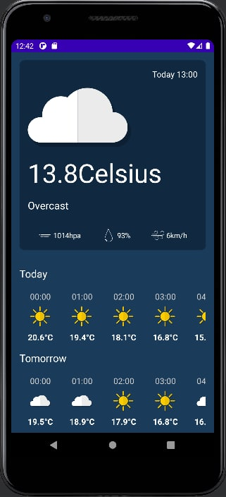
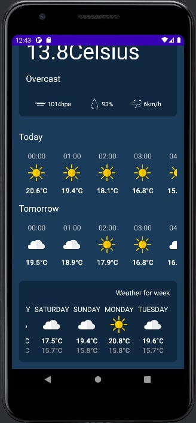

# WeatherApp_AndroidStudio
Приложение прогноза погоды  
С чем я работал:  
Jetpack Compose  
Retrofit  
Coroutines  
Dagger-Hilt(DI)  
Location Services  
MVI  
Clean Arhitecture    

 

Спасибо Philipp Lackner за обучающие уроки по Compose, Coroutines, Dagger-Hilt и Clean Arhitecture!  

